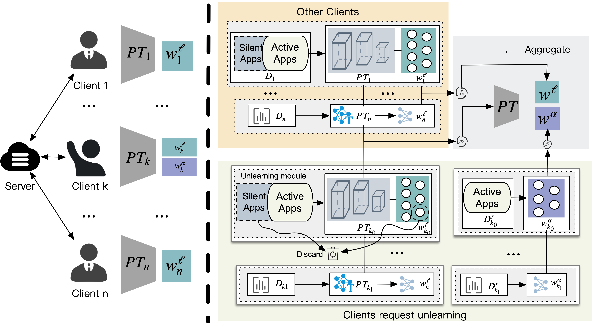

# 🦜 FedUnSilApp: Scalable Federated Machine Unlearning-based Encrypted Network Traffic Classification

  <a href="#-introduction">🎉Introduction</a> •
  <a href="#-model">🦜Model</a> •
  <a href="#-train">🔥Train</a> •
  <a href="#-datasets">🌟Datasets</a> •
  <a href="#-quick-start">📍Quick Start</a> •
  <a href="#-acknowledgement">👨‍🏫Acknowledgement</a> •  
  <a href="#-contact">🤗Contact</a>

## 🎉 Introduction

  

## 🌟Datasets
[njupt2023](https://github.com/NJUPTSecurityAI/total-papers-summary/blob/main/njupt2023.csv),
[MIRAGE-2019](https://traffic.comics.unina.it/mirage/mirage-2019.html),
[CIC-IDS](https://www.unb.ca/cic/datasets/vpn.html)

## 🔥 Train

## 👨‍🏫 Acknowledgement
This document is the results of the research project funded by National Natural Science Fundation (General Program) Grant No.61972211, China, University Industry Academy Research Innovation Fund No.2021FNA02006, China, Open trial of CENI-based network attack and defense exercise service platform No.2023C0302 and Development of an Ultra-large-scale Ubiquitous Network Quality Monitoring System Based on Trusted Edge Intelligence under Grant SYG202311.

## 🤗 Contact

If there are any questions, please feel free to propose new features by opening an issue or contacting the author: 2022040506@njupt.edu.cn
